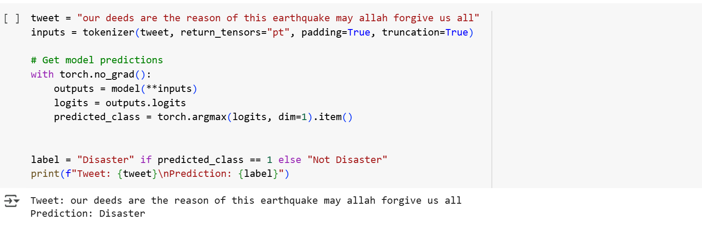

# **Disaster Tweet Classification using RoBERTa-Large:**
This project demonstrates the power of transformer-based architectures by fine-tuning the RoBERTa-large model for binary classification to determine whether a tweet refers to a real disaster or not.

# **Project Overview:**
Social media platforms, especially Twitter, are critical sources of real-time information during emergencies. However, distinguishing between actual disaster-related tweets and irrelevant content is a challenging task. This project leverages the RoBERTa-large pre-trained language model to tackle this problem using a real-world dataset.

**The goal is to adapt the model to accurately classify tweets as either disaster-related or not disaster-related through transfer learning.**

**Dataset used:**
🔗 Kaggle - [Natural Language Processing with Disaster Tweets](https://www.kaggle.com/competitions/nlp-getting-started)

# **Results:**
After fine-tuning, the RoBERTa-large model achieved strong performance on the validation set:

1. Evaluation Accuracy: 84.5%

2. Validation Loss: ~0.30

3. Validation F1-Score: 81.28%

These metrics demonstrate the model's ability to learn meaningful patterns from the tweet content, effectively distinguishing between disaster-related and non-disaster-related tweets.

# **Real-World Impact:**
Beyond evaluation metrics, the fine-tuned model demonstrated strong real-world performance. It not only generalized well to **unseen tweets**, correctly identifying disaster-related content outside the training set, but also provided **accurate predictions on examples from the dataset**, confirming that it effectively learned patterns present during training.

### 🔍  1. Model Prediction on a Tweet from the Dataset
- The model accurately predicted the label **"Disaster"** for the following tweet from the training data:

- The model accurately predicted the label **"Not Disaster"** for the following tweet from the training data:

.png")

---

### 🔍 2.  Model Prediction on a New Tweet (Unseen Example)
- The model also successfully predicted **Disaster-related content** for a new tweet not included in the training dataset.

.png")

- The model also successfully predicted **Not disaster-related content** for a new tweet not included in the training dataset.

.png")

